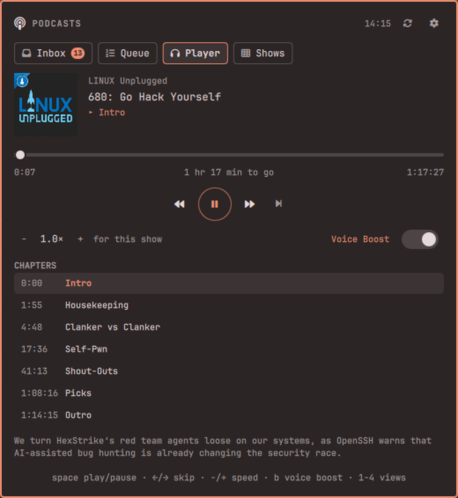

# Podcasts — an Omarchy bar plugin

New episodes land in an inbox on your bar. Triage them in five seconds. Play
the queue with voice boost and per-show speed. Quit the shell, come back, and
pick up where you left off.



## Features

- **An inbox, not a firehose.** Subscribing does not dump a back catalogue on
  you. Only episodes that arrive *after* you subscribe show up for triage, and
  the bar badge counts exactly those — the ones still waiting on a decision.
  `Enter` queues, `a` archives, `A` archives the lot. Inbox zero is the point.
- **A queue that plays itself.** Ordered, reorderable with `Shift+↑/↓`, and it
  auto-advances when an episode ends.
- **Playback that survives a restart.** Position is written every five seconds
  and on every pause; a shell restart costs you nothing.
- **Voice Boost.** One toggle levels quiet conversation against loud stings and
  ads (mpv's `dynaudnorm`) — the thing that makes podcasts listenable in a
  noisy room.
- **Per-show speed.** Set 1.6× on the fast talkers and 1.0× on the ones you
  actually want to hear; each show remembers its own.
- **Chapters.** Feeds that publish Podcasting 2.0 `podcast:chapters` get a
  clickable chapter list and a live "you are here" marker.
- **Three modes per show.** *Inbox* (triage it), *Auto-queue* (skip triage,
  queue it, notify me), *Ignore* (subscribed but silent — browse it manually).
  Notifications fire only for auto-queue shows; everything else is the badge's
  job.
- **Search as you type.** The iTunes directory needs no key and works out of
  the box. Shows you already have sort to the top; the rest appear underneath,
  five at a time. Paste an RSS URL for anything the directory does not list —
  including private Patreon and Supercast feeds.
- **OPML in and out**, through the desktop file chooser.
- **Polite to your machine.** Feeds are polled on a jittered schedule with
  conditional GET, so an unchanged feed costs a couple of hundred bytes. A feed
  that keeps failing is marked "not updating" instead of being retried forever.

## Install

```sh
omarchy plugin add https://github.com/Bottelet/omarchy-podcasts.git --enable
omarchy bar put bottelet.podcasts --after omarchy.clock
```

That installs to `~/.config/omarchy/plugins/bottelet.podcasts/`. Click the
podcast icon in your bar to open the panel; middle-click it to play or pause
without opening anything.

Optional hotkey, in `~/.config/hypr/bindings.conf` (or `bindings.lua`):

```
bind = SUPER, P, exec, omarchy-shell bottelet.podcasts toggle
```

## Using it

Open the panel and go to **Shows** and start typing. Results appear as you
type: your own subscriptions narrow at the top, and shows you are **not**
subscribed to appear underneath, five at a time — arrow past the last one (or
click *show more*) for the next five. Arrow onto a result and press `Enter` to
subscribe.

The same box takes a feed URL. Paste one and press `Enter` to subscribe
directly — that path waits for `Enter` on purpose, so a half-pasted address
never subscribes you to whatever it happens to resolve to. It is also how you
add private Patreon and Supercast feeds, which no directory lists.

New episodes then start arriving in your **Inbox**.

The four views are `1`–`4`, or click the tabs.

| Key | Inbox | Queue | Player | Shows |
| --- | --- | --- | --- | --- |
| `↑` `↓` / `j` `k` | move | move | — | move (past the last result loads more) |
| `Enter` | add to queue | play from here | — | subscribe / open show / queue episode |
| `Space` | play now | play now | play / pause | open show / play now |
| `Shift+↑/↓` | — | reorder | — | — |
| `x` | archive | remove | — | unsubscribe / archive |
| `a` / `A` | archive / archive all | — | — | archive |
| `←` `→` | — | — | back 15s / forward 30s | back to the grid |
| `-` `+` | — | — | slower / faster | — |
| `b` | voice boost | voice boost | voice boost | voice boost |
| `r` | check feeds now | | | |
| `/` | | | | focus search |
| `Esc` | close | close | close | close |

Right-click any episode row for the secondary action (play now in the inbox,
remove from the queue).

## Settings

The ⚙ button, or `omarchy bar set`:

| Key | Default | Meaning |
| --- | --- | --- |
| `pollMinutes` | `30` | Minutes between feed checks (minimum 10) |
| `defaultSpeed` | `1.0` | Speed for shows with no speed of their own |
| `voiceBoost` | `false` | Level quiet talk against loud music and ads |
| `podcastIndexKey` | *(empty)* | Optional — search Podcast Index instead of iTunes |
| `podcastIndexSecret` | *(empty)* | Paired with the key above |

```sh
omarchy bar set bottelet.podcasts pollMinutes 60
omarchy bar set bottelet.podcasts defaultSpeed 1.4
```

Subscriptions, the queue and your playback positions are not settings — they
live in `~/.local/share/omarchy-podcasts/`.

## Dependencies

Everything needed ships with a stock Omarchy install: `mpv`, `python3`
(standard library only), `curl`, `jq`, `notify-send`, and
`omarchy-file-select`. No pip packages, no Node, no bundled binaries.

If `mpv-mpris` is installed — it is, on stock Omarchy, at
`/etc/mpv/scripts/mpris.so` — playback is published on D-Bus, so your media
keys and any other now-playing widget pick it up for free. Nothing breaks
without it.

## Privacy & security

- The plugin talks to the iTunes search API, the feeds you subscribe to, and
  nothing else. There is no server, no telemetry, and no account unless you
  choose to supply a Podcast Index key.
- Feed content is treated as hostile input. Enclosure URLs reach mpv as JSON
  over its IPC socket — never as a command line, never through a shell. Every
  string a feed supplies is rendered as plain text, never as rich text, so a
  feed cannot make the panel fetch a remote image or beacon your IP.
- The panel never points an image at a remote URL. Artwork — for your shows
  and for search results alike — is downloaded by the helper, size-capped and
  type-checked from its magic bytes, and cached to disk first. A directory API
  cannot make your machine reach out to a host of its choosing.
- A feed cannot point the plugin at your own machine. Loopback and
  link-local addresses are refused on every URL a feed controls — its own,
  its artwork, its chapters — so a podcast cannot use your computer to reach
  a service only your computer can see. Feeds on your LAN still work, because
  self-hosting one is a reasonable thing to do.
- Feeds must be HTTPS. A feed that declares a DTD is refused outright (the
  billion-laughs amplification no download cap can catch). Downloads are
  capped — 15 MB per feed, 5 MB per artwork — with timeouts and no retry
  storms.
- Everything the plugin writes is `0700`/`0600` and lives under
  `~/.local/share/omarchy-podcasts/`.
- If you supply a Podcast Index key, it never appears on a command line —
  `/proc` is world-readable, so it goes over stdin to the helper and into
  curl through a config file instead.

Run the offline test suite yourself:

```sh
tests/run.sh
```

281 checks, no network — a stub curl serves fixtures and simulates redirects,
validators, and transport failures.

## Remove

```sh
omarchy bar remove bottelet.podcasts
omarchy plugin remove bottelet.podcasts
```

That removes the widget and the plugin. Your subscriptions, queue, playback
positions and cached artwork stay behind in
`~/.local/share/omarchy-podcasts/` so a reinstall picks up where you stopped.
Delete them too if you want a clean slate:

```sh
rm -rf ~/.local/share/omarchy-podcasts
```

## FAQ

**Can it play Spotify or YouTube exclusives?**
No, and neither can any other podcast client. Those shows are not published as
RSS, so there is nothing for a podcast app to fetch. If a show has a public
feed anywhere, paste that URL.

**Video podcasts?**
Audio only. Even when a feed's enclosure is a video file it plays with
`--no-video` — this is a bar widget, not a media player.

**Where are my downloads?**
There are none yet; episodes stream. Offline downloads are planned alongside
gpodder/AntennaPod sync.

**Can I sync with my phone?**
Not yet. gpodder.net / oPodSync sync — which AntennaPod on Android speaks
natively — is the next milestone.

## License

MIT. See [LICENSE](LICENSE), which also documents every external dependency
and every network service the plugin contacts.
